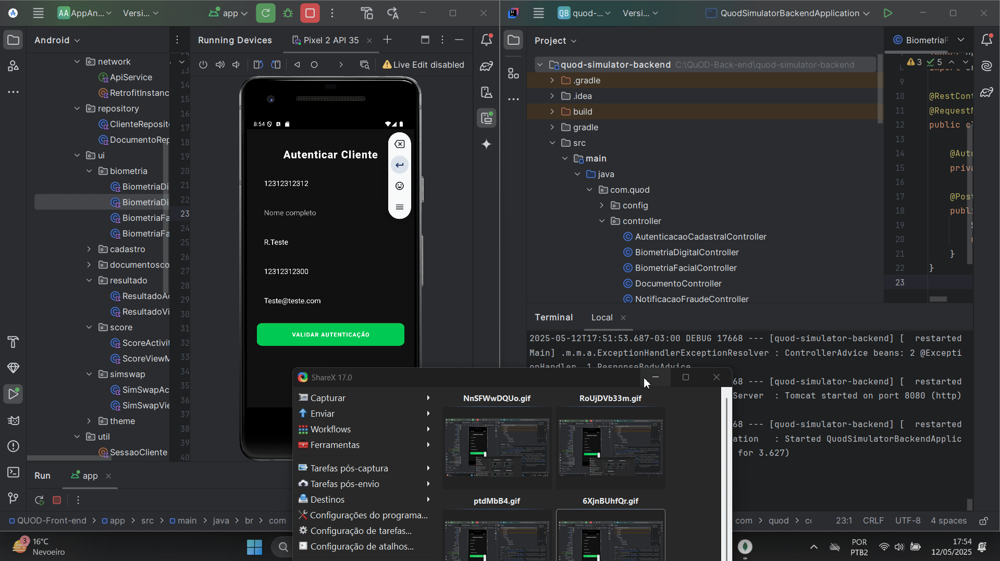
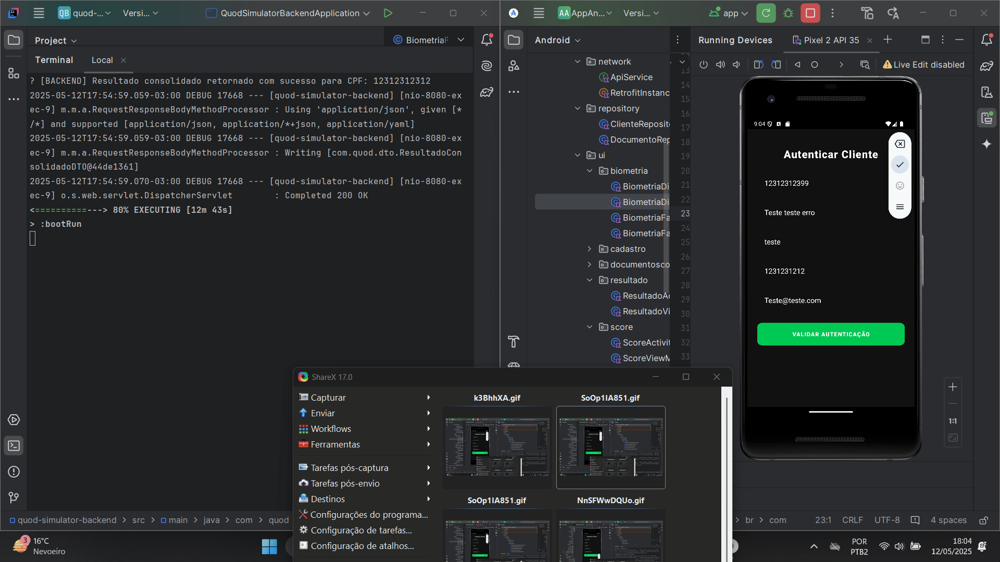

# 📱 QUOD Antifraude – App Mobile (Kotlin Android)

Este repositório contém o aplicativo mobile desenvolvido em **Kotlin com Jetpack Compose**, como parte da **Challenge FIAP 2025 em parceria com a QUOD**. O objetivo é simular um sistema antifraude capaz de validar eventos suspeitos de forma didática e demonstrativa.

Este projeto simula o fluxo de autenticação e validação de dados em um app antifraude completo, incluindo:
- Biometria Facial
- Biometria Digital
- Documentoscopia
- SIM Swap
- Score Antifraude
- Resultado Consolidado

> 🔗 Este front-end consome a API disponível no repositório:  
> [FIAP_QuOD-Backend](https://github.com/Joao-Markus-Barbosa/FIAP_QuOD-Backend)

---

## 🎯 Objetivo

- Simular processos de verificação antifraude em um fluxo completo
- Testar respostas visuais em situações de sucesso e fraude
- Permitir a demonstração comercial e acadêmica de processos antifraude reais

---

## 🧠 Lógica de Funcionamento

1. O usuário realiza o cadastro com CPF
2. Cada etapa de validação é acionada sequencialmente
3. O backend simula sucesso ou falha com base no final do CPF:
   - `9` → Falha na biometria facial
   - `8` → Falha na biometria digital
   - `7` → Falha na documentoscopia
   - Vazio → Falha automática
4. O app recebe e exibe o status de cada etapa, navegando conforme os resultados
5. O Resultado Consolidado exibe o status geral de todas as validações

---

## 🧰 Tecnologias Utilizadas

- Kotlin + Android Jetpack
- Jetpack Compose
- Retrofit 2.9.0
- Gson Converter
- ViewModel + LiveData
- Kotlin Coroutines
- Material Components
- JUnit / Espresso

---

## 🔗 Integração Fullstack

Este projeto representa uma **aplicação Fullstack**, composta por:

- **Front-end**: App Android desenvolvido em Kotlin
- **Back-end**: API Spring Boot para processamento das validações
- **Banco de Dados**: MongoDB (NoSQL), para persistência e rastreabilidade dos eventos

Toda requisição realizada pelo app é enviada ao back-end, que:
- Processa as validações
- Simula o comportamento real de sistemas antifraude
- Armazena os resultados no MongoDB
- Retorna a resposta para o front-end, que apresenta o resultado ao usuário

---

## 📊 Demonstrações (GIFs)

### ✅ Fluxo com Sucesso


### ❌ Fluxo com Falha (CPF termina em 9, 8 ou 7)


---

## 📂 Estrutura do App

```
app/
├── model/
├── network/
├── repository/
├── ui/
│   ├── biometria/
│   ├── documentoscopia/
│   └── resultado/
├── viewmodel/
└── theme/
```

---

## 🔗 Conectando com o Back-End

O app envia requisições HTTP para o back-end Java disponível em:  
[FIAP_QuOD-Backend](https://github.com/Joao-Markus-Barbosa/FIAP_QuOD-Backend)

---

## 🧾 Licença

Projeto acadêmico Challenge – FIAP 2025  
Parceria com: **QUOD - Soluções Antifraude**


